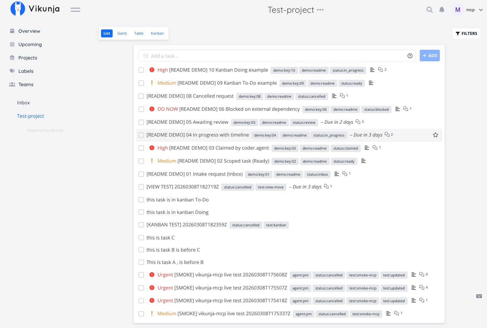
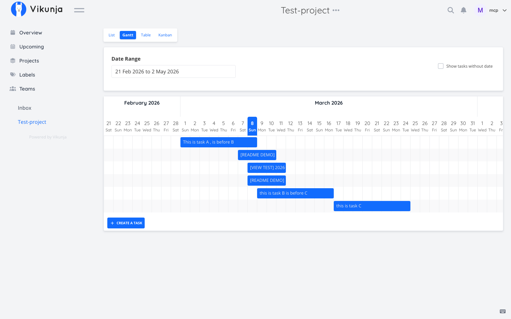
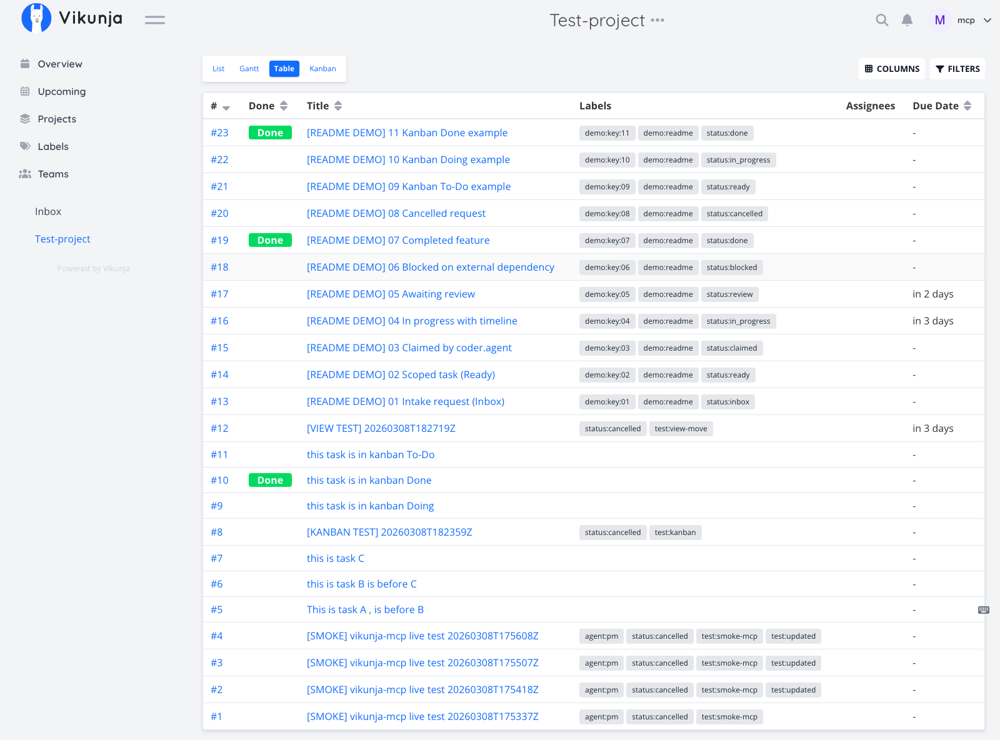
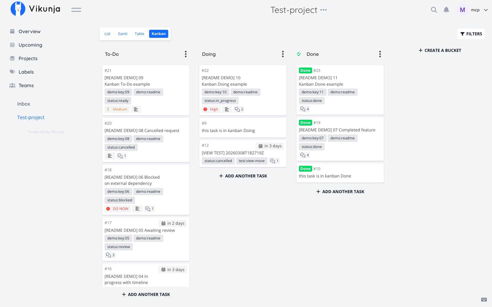
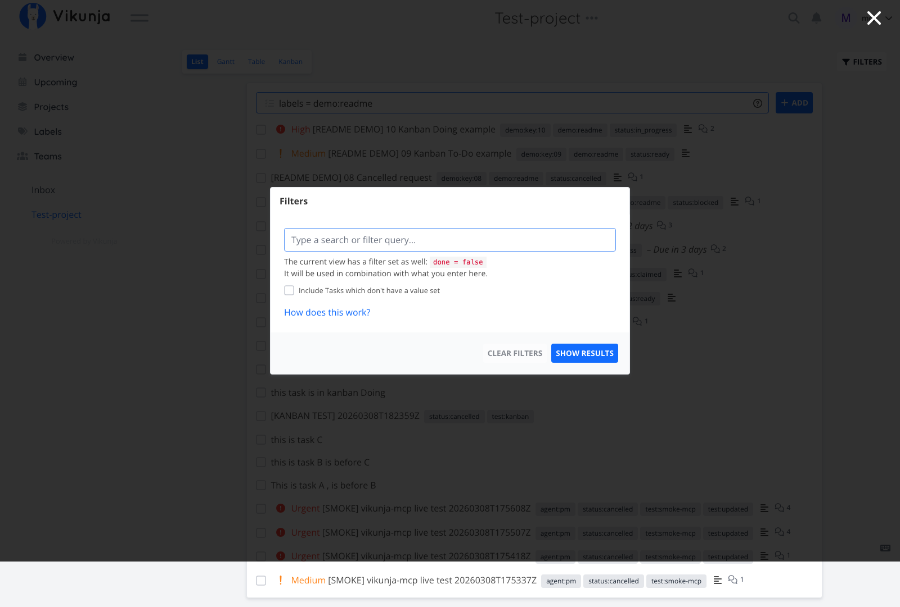
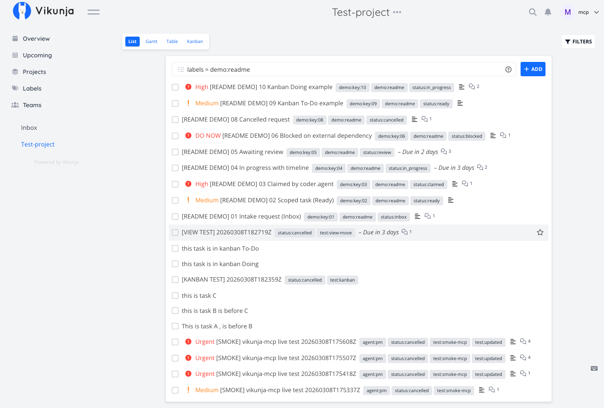
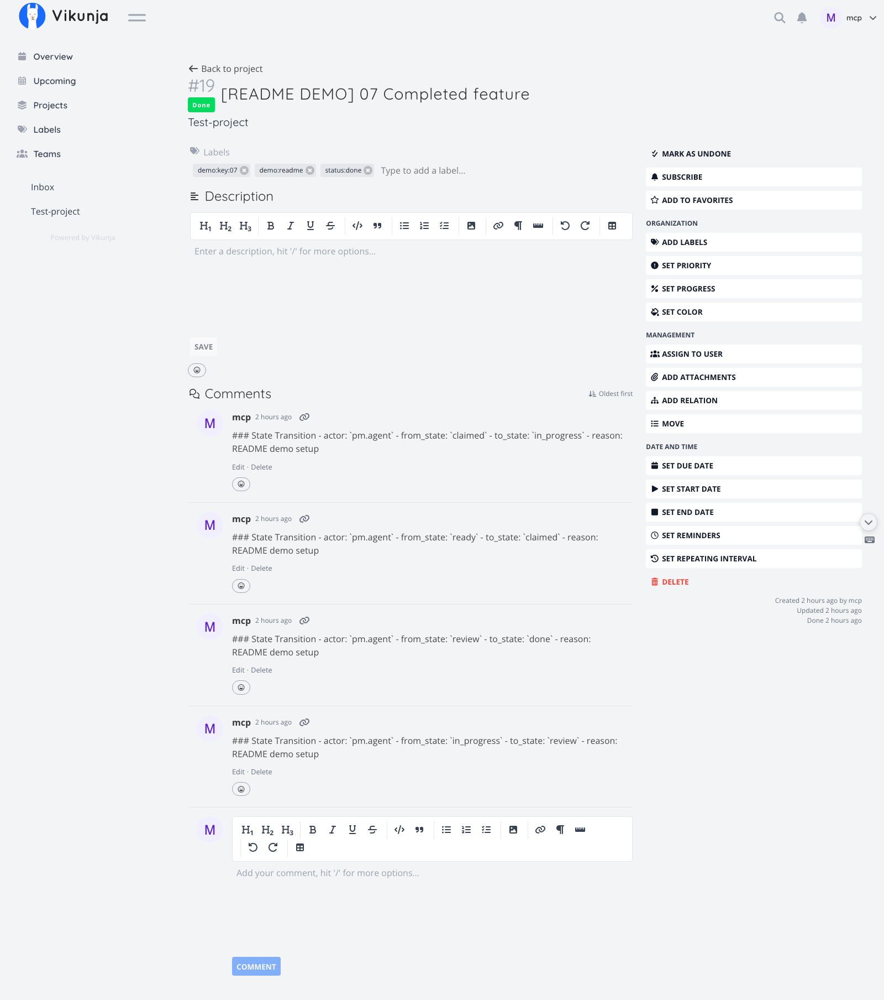
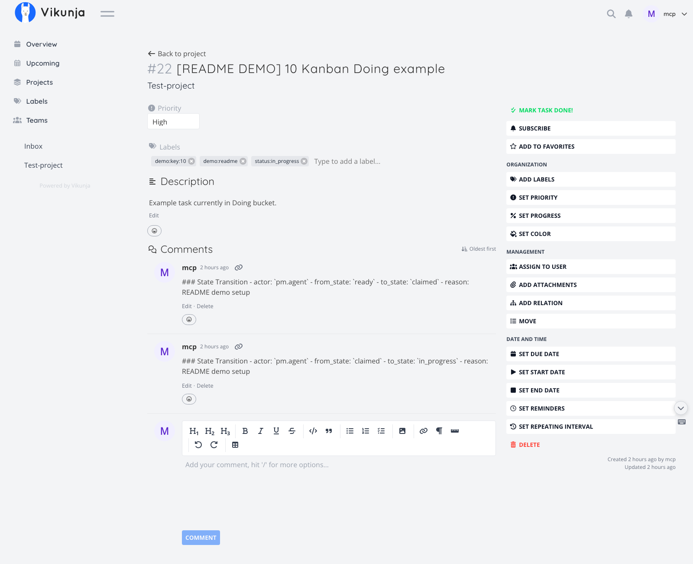

# vikunja-mcp-server

Production-oriented MCP server and local orchestration toolkit for using Vikunja as an AI task control plane.

## What this provides

- A Python MCP server exposing core workflow tools:
  1. `vikunja_list_tasks`
  2. `vikunja_get_task`
  3. `vikunja_create_task`
  4. `vikunja_update_task`
  5. `vikunja_transition_task`
  6. `vikunja_claim_next_task`
  7. `vikunja_add_execution_note`
  8. `vikunja_sync_fs_tasks`
- Additional view-aware tools for table/gantt/kanban:
  1. `vikunja_list_project_views`
  2. `vikunja_get_view_tasks`
  3. `vikunja_move_task_to_bucket`
  4. `vikunja_move_task_position`
  5. `vikunja_update_task` with `start_date`/`end_date` for gantt timeline moves
- State machine guardrails using `status:*` labels.
- SQLite-backed idempotency, task mapping, sync metadata, and claim locks.
- Local task manifest sync (`tasks/*.yaml`) and artifact path reporting (`outputs/`).
- Helper scripts for claim/execute/report/archive workflows.

## Stack

- Python 3.11+
- `httpx`, `pydantic`, `typer`, `python-dotenv`, `tenacity`, `mcp`, `PyYAML`

## Quick start

```bash
uv venv
source .venv/bin/activate
uv pip install -e .[dev]
cp .env.example .env
```

Edit `.env` and set your token/project.

Important optional env tuning:
- `VIKUNJA_MAX_PAGE_SIZE` (default `100`)
- `VIKUNJA_MAX_FETCH_TASKS` (default `500`)

## Commands

```bash
# Start MCP server (stdio transport)
uv run vikunja-mcp serve

# Validate config and connectivity
uv run vikunja-mcp doctor

# Sync local task manifests with Vikunja
uv run vikunja-mcp sync --project-id 44 --dry-run

# Claim next eligible task for an agent
uv run vikunja-mcp claim-next --project-id 44 --agent coder.agent --accepted-label agent:coder
```

## Helper scripts

```bash
# Claim + create local task YAML + outputs folder
uv run python scripts/claim_and_prepare.py --project-id 44 --agent coder.agent --accepted-label agent:coder

# Build prompt packet and run placeholder Aider command
uv run python scripts/run_task_with_aider.py tasks/TASK-123.yaml

# Report execution outcome back to Vikunja
uv run python scripts/report_task_result.py tasks/TASK-123.yaml --result success

# Move locally completed tasks to archive
uv run python scripts/close_completed_local_tasks.py

# Import Taskwarrior-style JSON into Vikunja
uv run python scripts/import_taskwarrior_json.py ./taskwarrior-export.json --project-id 44

# Capture README screenshots from Vikunja UI (Playwright)
uv run --extra dev python scripts/capture_vikunja_screenshots.py --headless
```

## UI walkthrough

### List view



### Gantt view



### Table view



### Kanban view



### Filters




### Task details




## Ecosystem references (as of 2026-03-08)

- [Vikunja official integrations](https://vikunja.io/docs/integrations/)
- [Vikunja n8n integration docs](https://vikunja.io/docs/integrations/n8n/)
- [Vja CLI (GitLab)](https://gitlab.com/go-vikunja/vja)
- [tw2vikunja migration tool](https://github.com/JohannSteffens/tw2vikunja)
- [Cria terminal UI for Vikunja](https://codeberg.org/alpha_v/cria)
- [Home Assistant Vikunja integration (community)](https://github.com/ruifern/homeassistant-vikunja)
- [Community Vikunja MCP server reference](https://github.com/democratize-technology/vikunja-mcp-server)

Detailed notes and adoption decisions are documented in `docs/ecosystem-implementations.md`.

View movement examples are in `docs/view-operations.md`.

## Task state model

Allowed states:
- `inbox`
- `ready`
- `claimed`
- `in_progress`
- `blocked`
- `review`
- `done`
- `cancelled`

Allowed transitions:
- `inbox -> ready, cancelled`
- `ready -> claimed, blocked, cancelled`
- `claimed -> in_progress, ready, blocked, cancelled`
- `in_progress -> review, blocked, ready, cancelled`
- `blocked -> ready, cancelled`
- `review -> done, ready, in_progress, cancelled`

## Source-of-truth split

- Vikunja: operational task control plane
- `tasks/*.yaml`: local execution manifest
- `outputs/`: execution artifacts
- `.orchestrator/vikunja_mcp.db`: sync and control metadata

## Testing

```bash
uv run pytest
```

Covered tests:
- state machine + label extraction/replacement
- deterministic claim ordering
- sync conflict detection
- create task idempotency
- client normalization helpers

## Repository layout

```text
.
├─ .env.example
├─ src/vikunja_mcp/
├─ scripts/
├─ tests/
├─ examples/
├─ tasks/
├─ tasks_done/
├─ outputs/
└─ .orchestrator/
```

## Notes

- The server is intentionally explicit and auditable.
- Vikunja API quirks can vary by version; client methods include compatibility fallback for task listing.
- Use one disciplined mutation layer (this MCP server) to avoid multi-agent state drift.
